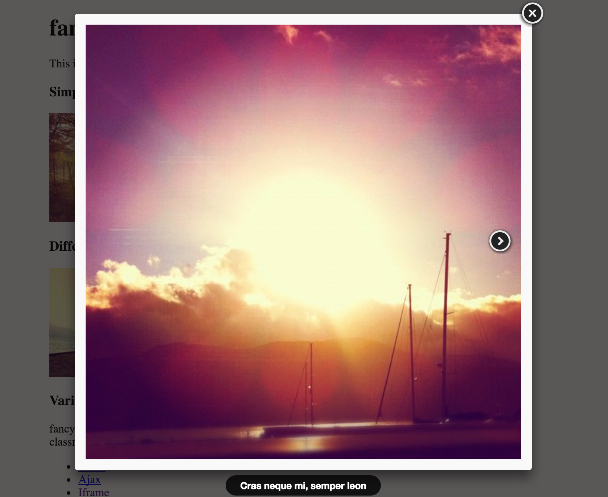

#前端插件资源整理
从入坑写代码到现在差不多一年了,当初很菜,现在还是很菜,不过总是每天都比前一天好,很享受这种状态,入坑时先进入的是前端领域,所以记录下自己做开发以来在前端领域发现并试用过的一些在自己看来不错的插件,作为自己一个阶段的集合,仅作为个人参考,如大神们发现坑的地方,欢迎指正!

 
# 1.[fancyBox-图片展示插件](http://fancyapps.com/fancybox/) 
  
##github star:3600+
##github fork:1000+
  
**Fancybox是一款优秀的jquery插件，它能够展示丰富的弹出层效果。前面我们有文章介绍了facybox弹出层效果，相比facybox，fancybox显得功能更为齐全，它除了可以加载DIV，图片、图片集、Ajax数据，还能加载SWF影片，iframe页面等等。**


```js
<!-- Add jQuery library -->
<script type="text/javascript" src="http://code.jquery.com/jquery-latest.min.js"></script>

<!-- Add mousewheel plugin (this is optional) -->
<script type="text/javascript" src="/fancybox/lib/jquery.mousewheel-3.0.6.pack.js"></script>

<!-- Add fancyBox -->
<link rel="stylesheet" href="/fancybox/source/jquery.fancybox.css?v=2.1.5" type="text/css" media="screen" />
<script type="text/javascript" src="/fancybox/source/jquery.fancybox.pack.js?v=2.1.5"></script>

<!-- Optionally add helpers - button, thumbnail and/or media -->
<link rel="stylesheet" href="/fancybox/source/helpers/jquery.fancybox-buttons.css?v=1.0.5" type="text/css" media="screen" />
<script type="text/javascript" src="/fancybox/source/helpers/jquery.fancybox-buttons.js?v=1.0.5"></script>
<script type="text/javascript" src="/fancybox/source/helpers/jquery.fancybox-media.js?v=1.0.6"></script>

<link rel="stylesheet" href="/fancybox/source/helpers/jquery.fancybox-thumbs.css?v=1.0.7" type="text/css" media="screen" />
<script type="text/javascript" src="/fancybox/source/helpers/jquery.fancybox-thumbs.js?v=1.0.7"></script>
```
```html
<a class="fancybox" rel="group" href="big_image_1.jpg"></a>
<a class="fancybox" rel="group" href="big_image_2.jpg"></a>

```
```
<script type="text/javascript">
	$(document).ready(function() {
		$(".fancybox").fancybox();
	});
</script>
```


* # [DEMO](http://www.jq22.com/yanshi28)
* # [github地址](https://github.com/fancyapps/fancyBox)


个人试验,适配移动端


# **2.[Swiper-滑动特效插件](http://www.swiper.com.cn/)**(pc)

##github star:7700+
##github fork:2800+


* **Swiper是纯javascript打造的滑动特效插件，面向手机、平板电脑等移动终端。**
* **Swiper能实现触屏焦点图、触屏Tab切换、触屏多图切换等常用效果.**
* **Swiper开源、免费、稳定、使用简单、功能强大，是架构移动终端网站的重要选择！**


```html
<!DOCTYPE html>
<html lang="en">
<head>
    <meta charset="utf-8">
    <title>Swiper demo</title>
    <!-- Link Swiper's CSS -->
    <link rel="stylesheet" href="../dist/css/swiper.min.css">

    <!-- Demo styles -->
    <style>
    body {
        background: #eee;
        font-family: Helvetica Neue, Helvetica, Arial, sans-serif;
        font-size: 14px;
        color:#000;
        margin: 0;
        padding: 0;
    }
    .swiper-container {
        width: 500px;
        height: 300px;
        margin: 20px auto;
    }
    .swiper-slide {
        text-align: center;
        font-size: 18px;
        background: #fff;
        
        /* Center slide text vertically */
        display: -webkit-box;
        display: -ms-flexbox;
        display: -webkit-flex;
        display: flex;
        -webkit-box-pack: center;
        -ms-flex-pack: center;
        -webkit-justify-content: center;
        justify-content: center;
        -webkit-box-align: center;
        -ms-flex-align: center;
        -webkit-align-items: center;
        align-items: center;
    }
    </style>
</head>
<body>
    <!-- Swiper -->
    <div class="swiper-container">
        <div class="swiper-wrapper">
            <div class="swiper-slide">Slide 1</div>
            <div class="swiper-slide">Slide 2</div>
            <div class="swiper-slide">Slide 3</div>
            <div class="swiper-slide">Slide 4</div>
            <div class="swiper-slide">Slide 5</div>
            <div class="swiper-slide">Slide 6</div>
            <div class="swiper-slide">Slide 7</div>
            <div class="swiper-slide">Slide 8</div>
            <div class="swiper-slide">Slide 9</div>
            <div class="swiper-slide">Slide 10</div>
        </div>
    </div>

    <!-- Swiper JS -->
    <script src="../dist/js/swiper.min.js"></script>

    <!-- Initialize Swiper -->
    <script>
    var swiper = new Swiper('.swiper-container');
    </script>
</body>
</html>
```


* # [DEMO](http://www.swiper.com.cn/demo/index.html)
* # [DEMO2](http://idangero.us/swiper/#.VwT6zxN94cg)
* # [github地址](https://github.com/nolimits4web/Swiper)


#3.[touchSlide-滑动特效插件](http://www.superslide2.com/)(mobile)

##github star:100+
##github fork:70+

**TouchSlide 是纯javascript打造的触屏滑动特效插件，面向手机、平板电脑等移动终端，
能实现触屏焦点图、触屏Tab切换、触屏多图切换等常用效果。
插件开源、体积小、简单实用、功能强大，是你架构移动终端网站的重要选择！**

1、引用TouchSlide.js
```js
<script type="text/javascript" src="../TouchSlide.1.0.js"></script>
```
2、编写HTML
```html
<div id="leftTabBox" class="tabBox">
    <div class="hd">
        <ul>
            <li>国内</li>
            <li>国际</li>
            <li>时事</li>
        </ul>
    </div>
    <div class="bd">
            <ul>
                <li><a href="#">官方明确感染H7N9高危人群</a></li>
                ...
            </ul>
            <ul>
                <li><a href="#">日:沈阳军区部队开赴中朝边境</a></li>
                ...
            </ul>
            <ul>
                <li><a href="#">农业占GDP低政府支持力度大</a></li>
                ...
            </ul>
    </div>
</div>
```
3、编写CSS，为HTML赋予样色

```css
.tabBox .hd{ height:40px; line-height:40px; padding:0 10px; font-size:20px; background:#f4f4f4; border-bottom:1px solid #F5AB38; position:relative;  }
.tabBox .hd ul{ position:absolute; height:41px; top:0; overflow:hidden;  }
.tabBox .hd ul li{ float:left; padding:0 10px; color:#666;  }
.tabBox .hd ul .on{ border:2px solid #F5AB38; border-bottom-color:#fff; background:#fff; color:#CF7F21;   }
.tabBox .bd ul{ padding:10px 0 10px 10px;  }
.tabBox .bd li{ height:33px; line-height:33px;   }
.tabBox .bd li a{ color:#666;  }
```
4、调用TouchSlide

```js
<script type="text/javascript">TouchSlide({ slideCell:"#leftTabBox" });</script>
```

# [DEMO](http://www.superslide2.com/TouchSlide/demo.html)


个人亲测,移动端可高度自适应

#4.[loader.css-css动画加载特效](https://connoratherton.com/loaders)

##github star:6000+
##github fork:680+

**Loaders.css是一款非常出色的加载动画框架，Loaders.css利用纯CSS可以实现很多种样式的Loading加载动画，这些动画并不需要图片来辅助，而是仅仅需要CSS即可实现，因此运行效率比较不错。**

**Loaders.css的特点**

* **基于纯CSS，不需JavaScript脚本，也不需要图片，很干净。
默认提供近30个不同的Loading动画效果，你也可以发挥自己的想象来实现不同的加载动画。**
* **Loaders.css比较轻巧，基本没什么臃肿的文件。
免费、开源，这是必须的。**

1.引入 loaders.min.css 和 loaders.css.js，这个JS仅是为了简化动画的DIV标签，如果不加这个JS，那么你的动画就必须加上对应数量DIV标签才能正常显示动画，所以建议加上，这样语义化好会好些。

```html
<link rel="stylesheet" type="text/css" href="loaders.min.css">
<script type="text/javascript" src="loaders.css.js"></script>
```
2.HTML代码，给loading元素加入动画class

```html
<div class="loader-inner ball-pulse"></div>
```
3.改变加载动画颜色

```css
.ball-grid-pulse > div {
 background: orange;
}
```
* # [DEMO](https://connoratherton.com/loaders)
* # [github地址](https://github.com/ConnorAtherton/loaders.css)


# 5.[chosen-强大的jquery模拟下拉框(select)插件](http://www.vaikan.com/docs/Chosen/Chosen.htm)

##github star:19000+
##github fork:3700+


**Chosen 是一个JavaScript插件，它能让丑陋的、很长的select选择框变的更好看、更方便。目前，它支持 jQuery 和 Prototype 两种JavaScript引擎。**

1.引入jquery库和脚本
```js
<script src="https://ajax.googleapis.com/ajax/libs/jquery/1.7.1/jquery.min.js" type="text/javascript"></script>
<script src="chosen/chosen.jquery.js" type="text/javascript"></script> 
```

2.选择框html片段
```html
<select class="chzn-select" data-placeholder="Choose a Country" style="width:350px;" tabindex="1">
       <option value=""></option> 
       <option value="United States">United States</option> 
       <option value="United Kingdom">United Kingdom</option> 
       <option value="Afghanistan">Afghanistan</option> 
       <option value="Albania">Albania</option> 
                 ...
</select>
```

3.初始化组件

```js
$(".chzn-select").chosen();
```
* #[DEMO](http://www.vaikan.com/docs/Chosen/Chosen.htm)
* #[github地址](https://github.com/harvesthq/chosen/)


# 6.[Mobiscroll-移动端日期时间滑动、滚动插件-可以各种自定义](http://demo.mobiscroll.com/)

##github star:880+
##github fork:360+

### 强烈推荐

**移动端自适应日期时间插件,可以各种自定义,ui 666,不过官网貌似要花钱,不过大天朝,你懂的.**


1.引jquery.js,jquerymobile.js 等等必须的文件


2.

```html
<div data-role="fieldcontain">
      <label for="txtBirthday">出生日期：</label>
      <input type="text" data-role="datebox"   id="txtBirthday" name="birthday" />
</div>
```

3.初始化日期控件

```js
$('input:jqmData(role="datebox")').mobiscroll().date();
```
```js
var opt = {
        preset: 'date', //日期
        theme: 'jqm', //皮肤样式
        display: 'modal', //显示方式 
        mode: 'clickpick', //日期选择模式
        dateFormat: 'yy-mm-dd', // 日期格式
        setText: '确定', //确认按钮名称
        cancelText: '取消',//取消按钮名籍我
        dateOrder: 'yymmdd', //面板中日期排列格式
        dayText: '日', monthText: '月', yearText: '年', //面板中年月日文字
        endYear:2020 //结束年份
    };
    
    $('input:jqmData(role="datebox")').mobiscroll(opt);
```
* #  [DEMO](demo.mobiscroll.com)
* # [github](https://github.com/acidb/mobiscroll)


# 7.[Sweet Alert-js超酷消息警告框插件](http://www.dglives.com/demo/sweetalert-master/example/)

##github star:13000+
##github fork:1600+


**SweetAlert是一款神奇的javascript弹出消息警告框插件。**

1.要使用该插件，首先要在html的header中引入以下文件
```html
<script src="lib/sweet-alert.min.js"></script>
<link rel="stylesheet" type="text/css" href="lib/sweet-alert.css">

```
2.最基本的调用方法：

```js
sweetAlert("Hello world!");
```

3.带错误图标的警告框：

```js
sweetAlert("Oops...", "Something went wrong!", "error");
```
4.一个带有确认按钮的警告框，点击确认按钮可触发动画：

```js
sweetAlert({
  title: "Are you sure?",
  text: "You will not be able to recover this imaginary file!",
  type: "warning",
  showCancelButton: true,
  confirmButtonColor: "#DD6B55",
  confirmButtonText: "Yes, delete it!",
  closeOnConfirm: false
}, function(){
  swal("Deleted!",
  "Your imaginary file has been deleted.",
  "success");
});
```

* #[DEMO](http://www.dglives.com/demo/sweetalert-master/example/)

* #[github](https://github.com/t4t5/sweetalert)

亲测:UI很漂亮

#8.[VEX-小而美的jquery-css动画消息警告库](http://github.hubspot.com/vex/docs/welcome/)

##github star:5000+
##github fork:300+

**可用作幻灯片样式**


1.引入文件

```js
<script src="vex.combined.min.js"></script>
<script>vex.defaultOptions.className = 'vex-theme-os';</script>
<link rel="stylesheet" href="vex.css" />
<link rel="stylesheet" href="vex-theme-os.css" />
```


2  
```js
vex.dialog.confirm
    message: 'Are you absolutely sure you want to destroy the alien planet?'
    callback: (value) ->
        console.log if value then 'Successfully destroyed the planet.' else 'Chicken.'
```

* #[DEMO](http://github.hubspot.com/vex/docs/welcome/)

* #[github](https://github.com/HubSpot/vex)